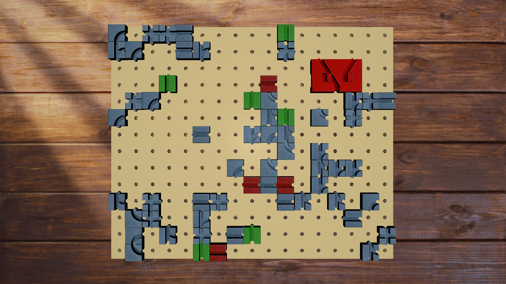
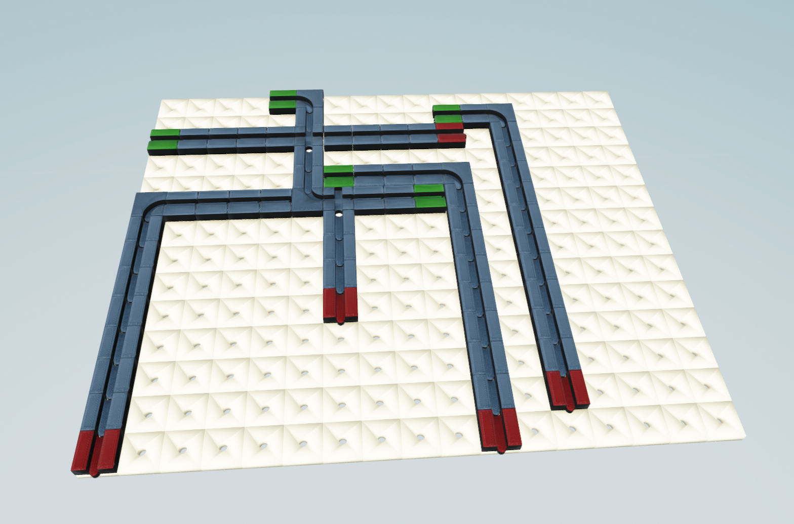
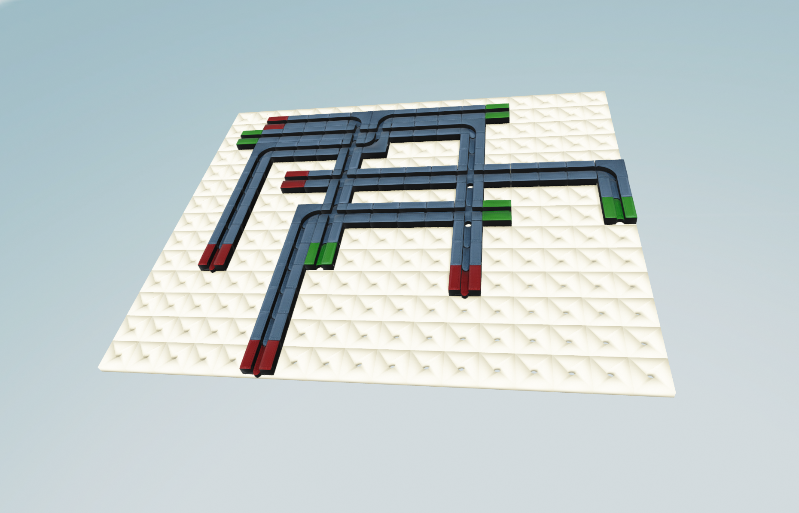

# Synthetic scheme plane generation



## Config requirements

For detail and board rendering Open3D requires OBJ files of each detail (texture is optional).
Detail information **must** be filled in configs/detail_config.json file.
The example and explanation of config is provided in **configs_example** folder.

For dataset generation camera and background position **must** be specified, 
so that the view will stay fixed during taking images. 
Sample of the render options is provided in **configs_example** folder. 

## Generation types

The board is represented as the matrix 14x17 and can be filled in 2 ways:
- random_fill - randomly places details on the board. If among the details there are some, 
    that take more than square 1x1, option **generate_big_shapes** can toggle their generation.


- map_fill - generates paths of small details using A-star algorithm. Amount of paths must be specified.



## Simple preview visualization

For previewing of scene rendering in **main.py** **casual_run** function is available.
It generates scene with rendered objects according to their position on the board.



## Dataset creation

Generation of images and masks is performed by **GenerationVisualization** class in **main.py**.

Masks can be created in tow different types - class and instance - which 
can be specified in **generate_board_mask** class function. Generated images and masks are 
sorted into folders in **dataset** folder. Is assets are specified, 
background of the plane image can be filled with another image.
Additionally, masks can be visualized by display_function in utils.

## Dataset formatting

Due to the use of generated data as training dataset for YOLO model, script to convert generated dataset 
into yolo ultralitics compatible format is provided. It is placed in utils/dataset_formatting file.

In the result, the **yolo_dataset** folder and YAML file is created. 
**yolo_dataset** consists of train and validation folders for images and labels (txt files). 
Train/val/test split is also avalible.

Resulting dataset can be used for the YOLO model training.

## Run

```bash
  python main.py 
```
